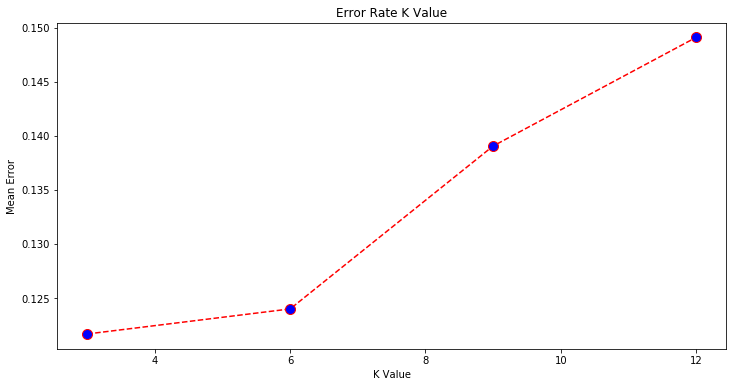

```python
# -*- coding: utf-8 -*-
"""
Created on Wed Dec 11 00:47:28 2019
Detect malware applications (android) through network traffic classification
@author: Riyadh Uddin
"""
import numpy as np
import matplotlib.pyplot as plt
import pandas as pd
import seaborn as sns
from sklearn.model_selection import train_test_split
from sklearn.preprocessing import StandardScaler
from sklearn.neighbors import KNeighborsClassifier
from sklearn.ensemble import RandomForestClassifier
from sklearn import preprocessing
from sklearn.metrics import classification_report, confusion_matrix, accuracy_score
from sklearn.metrics import roc_auc_score,roc_curve
#importing lib
```


```python
# =============================================================================
# load data file
# URL=('www.kaggle.com/xwolf12/android-malware-analysis/data')
# =============================================================================
dataset = pd.read_csv("android_traffic.csv", sep=";")
# =============================================================================
#dataset.head()
#Data cleaning & processing
#dataset.isna().sum()
#We had to drop empty or NAN columns
#dataset.describe()
#now lets check and clean the duplicates
#dataset[dataset.duplicated()].sum()
# =============================================================================
```


```python
dataset.head()
```


<div>
<style scoped>
    .dataframe tbody tr th:only-of-type {
        vertical-align: middle;
    }

    .dataframe tbody tr th {
        vertical-align: top;
    }

    .dataframe thead th {
        text-align: right;
    }
</style>
<table border="1" class="dataframe">
  <thead>
    <tr style="text-align: right;">
      <th></th>
      <th>name</th>
      <th>tcp_packets</th>
      <th>dist_port_tcp</th>
      <th>external_ips</th>
      <th>vulume_bytes</th>
      <th>udp_packets</th>
      <th>tcp_urg_packet</th>
      <th>source_app_packets</th>
      <th>remote_app_packets</th>
      <th>source_app_bytes</th>
      <th>remote_app_bytes</th>
      <th>duracion</th>
      <th>avg_local_pkt_rate</th>
      <th>avg_remote_pkt_rate</th>
      <th>source_app_packets.1</th>
      <th>dns_query_times</th>
      <th>type</th>
    </tr>
  </thead>
  <tbody>
    <tr>
      <td>0</td>
      <td>AntiVirus</td>
      <td>36</td>
      <td>6</td>
      <td>3</td>
      <td>3911</td>
      <td>0</td>
      <td>0</td>
      <td>39</td>
      <td>33</td>
      <td>5100</td>
      <td>4140</td>
      <td>NaN</td>
      <td>NaN</td>
      <td>NaN</td>
      <td>39</td>
      <td>3</td>
      <td>benign</td>
    </tr>
    <tr>
      <td>1</td>
      <td>AntiVirus</td>
      <td>117</td>
      <td>0</td>
      <td>9</td>
      <td>23514</td>
      <td>0</td>
      <td>0</td>
      <td>128</td>
      <td>107</td>
      <td>26248</td>
      <td>24358</td>
      <td>NaN</td>
      <td>NaN</td>
      <td>NaN</td>
      <td>128</td>
      <td>11</td>
      <td>benign</td>
    </tr>
    <tr>
      <td>2</td>
      <td>AntiVirus</td>
      <td>196</td>
      <td>0</td>
      <td>6</td>
      <td>24151</td>
      <td>0</td>
      <td>0</td>
      <td>205</td>
      <td>214</td>
      <td>163887</td>
      <td>24867</td>
      <td>NaN</td>
      <td>NaN</td>
      <td>NaN</td>
      <td>205</td>
      <td>9</td>
      <td>benign</td>
    </tr>
    <tr>
      <td>3</td>
      <td>AntiVirus</td>
      <td>6</td>
      <td>0</td>
      <td>1</td>
      <td>889</td>
      <td>0</td>
      <td>0</td>
      <td>7</td>
      <td>6</td>
      <td>819</td>
      <td>975</td>
      <td>NaN</td>
      <td>NaN</td>
      <td>NaN</td>
      <td>7</td>
      <td>1</td>
      <td>benign</td>
    </tr>
    <tr>
      <td>4</td>
      <td>AntiVirus</td>
      <td>6</td>
      <td>0</td>
      <td>1</td>
      <td>882</td>
      <td>0</td>
      <td>0</td>
      <td>7</td>
      <td>6</td>
      <td>819</td>
      <td>968</td>
      <td>NaN</td>
      <td>NaN</td>
      <td>NaN</td>
      <td>7</td>
      <td>1</td>
      <td>benign</td>
    </tr>
  </tbody>
</table>
</div>


```python
dataset.isna().sum()
```


    name                       0
    tcp_packets                0
    dist_port_tcp              0
    external_ips               0
    vulume_bytes               0
    udp_packets                0
    tcp_urg_packet             0
    source_app_packets         0
    remote_app_packets         0
    source_app_bytes           0
    remote_app_bytes           0
    duracion                7845
    avg_local_pkt_rate      7845
    avg_remote_pkt_rate     7845
    source_app_packets.1       0
    dns_query_times            0
    type                       0
    dtype: int64


```python
dataset.describe()
```


<div>
<style scoped>
    .dataframe tbody tr th:only-of-type {
        vertical-align: middle;
    }

    .dataframe tbody tr th {
        vertical-align: top;
    }

    .dataframe thead th {
        text-align: right;
    }
</style>
<table border="1" class="dataframe">
  <thead>
    <tr style="text-align: right;">
      <th></th>
      <th>tcp_packets</th>
      <th>dist_port_tcp</th>
      <th>external_ips</th>
      <th>vulume_bytes</th>
      <th>udp_packets</th>
      <th>tcp_urg_packet</th>
      <th>source_app_packets</th>
      <th>remote_app_packets</th>
      <th>source_app_bytes</th>
      <th>remote_app_bytes</th>
      <th>duracion</th>
      <th>avg_local_pkt_rate</th>
      <th>avg_remote_pkt_rate</th>
      <th>source_app_packets.1</th>
      <th>dns_query_times</th>
    </tr>
  </thead>
  <tbody>
    <tr>
      <td>count</td>
      <td>7845.000000</td>
      <td>7845.000000</td>
      <td>7845.000000</td>
      <td>7.845000e+03</td>
      <td>7845.000000</td>
      <td>7845.000000</td>
      <td>7845.000000</td>
      <td>7845.000000</td>
      <td>7.845000e+03</td>
      <td>7.845000e+03</td>
      <td>0.0</td>
      <td>0.0</td>
      <td>0.0</td>
      <td>7845.000000</td>
      <td>7845.000000</td>
    </tr>
    <tr>
      <td>mean</td>
      <td>147.578713</td>
      <td>7.738177</td>
      <td>2.748502</td>
      <td>1.654375e+04</td>
      <td>0.056724</td>
      <td>0.000255</td>
      <td>152.911918</td>
      <td>194.706310</td>
      <td>2.024967e+05</td>
      <td>1.692260e+04</td>
      <td>NaN</td>
      <td>NaN</td>
      <td>NaN</td>
      <td>152.911918</td>
      <td>4.898917</td>
    </tr>
    <tr>
      <td>std</td>
      <td>777.920084</td>
      <td>51.654222</td>
      <td>2.923005</td>
      <td>8.225650e+04</td>
      <td>1.394046</td>
      <td>0.015966</td>
      <td>779.034618</td>
      <td>1068.112696</td>
      <td>1.401076e+06</td>
      <td>8.238182e+04</td>
      <td>NaN</td>
      <td>NaN</td>
      <td>NaN</td>
      <td>779.034618</td>
      <td>18.900478</td>
    </tr>
    <tr>
      <td>min</td>
      <td>0.000000</td>
      <td>0.000000</td>
      <td>0.000000</td>
      <td>0.000000e+00</td>
      <td>0.000000</td>
      <td>0.000000</td>
      <td>1.000000</td>
      <td>0.000000</td>
      <td>0.000000e+00</td>
      <td>6.900000e+01</td>
      <td>NaN</td>
      <td>NaN</td>
      <td>NaN</td>
      <td>1.000000</td>
      <td>0.000000</td>
    </tr>
    <tr>
      <td>25%</td>
      <td>6.000000</td>
      <td>0.000000</td>
      <td>1.000000</td>
      <td>8.880000e+02</td>
      <td>0.000000</td>
      <td>0.000000</td>
      <td>7.000000</td>
      <td>7.000000</td>
      <td>9.340000e+02</td>
      <td>1.046000e+03</td>
      <td>NaN</td>
      <td>NaN</td>
      <td>NaN</td>
      <td>7.000000</td>
      <td>1.000000</td>
    </tr>
    <tr>
      <td>50%</td>
      <td>25.000000</td>
      <td>0.000000</td>
      <td>2.000000</td>
      <td>3.509000e+03</td>
      <td>0.000000</td>
      <td>0.000000</td>
      <td>30.000000</td>
      <td>24.000000</td>
      <td>4.090000e+03</td>
      <td>3.803000e+03</td>
      <td>NaN</td>
      <td>NaN</td>
      <td>NaN</td>
      <td>30.000000</td>
      <td>3.000000</td>
    </tr>
    <tr>
      <td>75%</td>
      <td>93.000000</td>
      <td>0.000000</td>
      <td>4.000000</td>
      <td>1.218900e+04</td>
      <td>0.000000</td>
      <td>0.000000</td>
      <td>98.000000</td>
      <td>92.000000</td>
      <td>2.624400e+04</td>
      <td>1.261000e+04</td>
      <td>NaN</td>
      <td>NaN</td>
      <td>NaN</td>
      <td>98.000000</td>
      <td>5.000000</td>
    </tr>
    <tr>
      <td>max</td>
      <td>37143.000000</td>
      <td>2167.000000</td>
      <td>43.000000</td>
      <td>4.226790e+06</td>
      <td>65.000000</td>
      <td>1.000000</td>
      <td>37150.000000</td>
      <td>45928.000000</td>
      <td>6.823516e+07</td>
      <td>4.227323e+06</td>
      <td>NaN</td>
      <td>NaN</td>
      <td>NaN</td>
      <td>37150.000000</td>
      <td>913.000000</td>
    </tr>
  </tbody>
</table>
</div>


```python
dataset[dataset.duplicated()].sum()
```


    name                    AntiVirusAntiVirusAntiVirusAntiVirusAntiVirusA...
    tcp_packets                                                         15038
    dist_port_tcp                                                        3514
    external_ips                                                         1434
    vulume_bytes                                                      2061210
    udp_packets                                                            38
    tcp_urg_packet                                                          0
    source_app_packets                                                  21720
    remote_app_packets                                                  18841
    source_app_bytes                                                  8615120
    remote_app_bytes                                                  2456160
    duracion                                                                0
    avg_local_pkt_rate                                                      0
    avg_remote_pkt_rate                                                     0
    source_app_packets.1                                                21720
    dns_query_times                                                      5095
    type                    benignbenignbenignbenignbenignbenignbenignbeni...
    dtype: object


```python
dataset = dataset.drop(['duracion','avg_local_pkt_rate','avg_remote_pkt_rate','tcp_urg_packet'], axis=1).copy()
dataset=dataset.drop('source_app_packets.1',axis=1).copy()
```


```python
# =============================================================================
# Feature Scaling
# =============================================================================
scaler = preprocessing.RobustScaler()
scaledData = scaler.fit_transform(dataset.iloc[:,1:11])
scaledData = pd.DataFrame(scaledData, columns=['tcp_packets','dist_port_tcp','external_ips','vulume_bytes','udp_packets','source_app_packets','remote_app_packets',' source_app_bytes','remote_app_bytes','dns_query_times'])
```


```python
# =============================================================================
# Training and Predictions
# =============================================================================
```


```python
X_train, X_test, y_train, y_test = train_test_split(scaledData.iloc[:,0:10],dataset.type.astype("str"), test_size=0.33, random_state=101)
```


```python
# =============================================================================
# K Neighbor classification
# Calculating error for K values 
# =============================================================================
```


```python
error = []
for i in range(3, 15, 3):
    knn = KNeighborsClassifier(n_neighbors=i)
    knn.fit(X_train, y_train)
    pred_i = knn.predict(X_test)
    error.append(np.mean(pred_i != y_test))
    accuracy = accuracy_score(pred_i, y_test)
    print("kneighbors {}".format(i))
    print("Accuracy:",accuracy)
    print("Error:",error)
    print("Confusion Matrix \n",confusion_matrix(y_test, pred_i))
    print("Classification Report: \n",classification_report(y_test, pred_i))
```

    kneighbors 3
    Accuracy: 0.8783314020857474
    Error: [0.12166859791425261]
    Confusion Matrix 
     [[1404  168]
     [ 147  870]]
    Classification Report: 
                   precision    recall  f1-score   support
    
          benign       0.91      0.89      0.90      1572
       malicious       0.84      0.86      0.85      1017
    
        accuracy                           0.88      2589
       macro avg       0.87      0.87      0.87      2589
    weighted avg       0.88      0.88      0.88      2589
    
    kneighbors 6
    Accuracy: 0.8760139049826188
    Error: [0.12166859791425261, 0.12398609501738123]
    Confusion Matrix 
     [[1425  147]
     [ 174  843]]
    Classification Report: 
                   precision    recall  f1-score   support
    
          benign       0.89      0.91      0.90      1572
       malicious       0.85      0.83      0.84      1017
    
        accuracy                           0.88      2589
       macro avg       0.87      0.87      0.87      2589
    weighted avg       0.88      0.88      0.88      2589
    
    kneighbors 9
    Accuracy: 0.8609501738122828
    Error: [0.12166859791425261, 0.12398609501738123, 0.13904982618771727]
    Confusion Matrix 
     [[1369  203]
     [ 157  860]]
    Classification Report: 
                   precision    recall  f1-score   support
    
          benign       0.90      0.87      0.88      1572
       malicious       0.81      0.85      0.83      1017
    
        accuracy                           0.86      2589
       macro avg       0.85      0.86      0.86      2589
    weighted avg       0.86      0.86      0.86      2589
    
    kneighbors 12
    Accuracy: 0.850907686365392
    Error: [0.12166859791425261, 0.12398609501738123, 0.13904982618771727, 0.14909231363460795]
    Confusion Matrix 
     [[1380  192]
     [ 194  823]]
    Classification Report: 
                   precision    recall  f1-score   support
    
          benign       0.88      0.88      0.88      1572
       malicious       0.81      0.81      0.81      1017
    
        accuracy                           0.85      2589
       macro avg       0.84      0.84      0.84      2589
    weighted avg       0.85      0.85      0.85      2589
    
    


```python
# =============================================================================
# Random Forest Classifier
# =============================================================================
```


```python
randomForest=RandomForestClassifier(n_estimators=250,
                                    max_depth=50,
                                    bootstrap = True,
                                    random_state=45)
randomForest.fit(X_train,y_train)
pred=randomForest.predict(X_test)
accuracy = accuracy_score(y_test,pred)
print(randomForest)
print("Accuracy:",accuracy)
print("Confusion Matrix \n",confusion_matrix(y_test, pred))
print("Classification Report: \n",classification_report(y_test, pred))
```

    RandomForestClassifier(bootstrap=True, class_weight=None, criterion='gini',
                           max_depth=50, max_features='auto', max_leaf_nodes=None,
                           min_impurity_decrease=0.0, min_impurity_split=None,
                           min_samples_leaf=1, min_samples_split=2,
                           min_weight_fraction_leaf=0.0, n_estimators=250,
                           n_jobs=None, oob_score=False, random_state=45, verbose=0,
                           warm_start=False)
    Accuracy: 0.9061413673232909
    Confusion Matrix 
     [[1466  106]
     [ 137  880]]
    Classification Report: 
                   precision    recall  f1-score   support
    
          benign       0.91      0.93      0.92      1572
       malicious       0.89      0.87      0.88      1017
    
        accuracy                           0.91      2589
       macro avg       0.90      0.90      0.90      2589
    weighted avg       0.91      0.91      0.91      2589
    
    


```python
# ============
#xtra coding for roc curve, precision recall will goes here
# =============================================================================
# plt k neighbor error
# =============================================================================
```


```python
plt.figure(figsize=(12, 6))
plt.plot(range(3,15,3), error, color='red', linestyle='dashed', marker='o',
         markerfacecolor='blue', markersize=10)
plt.title('Error Rate K Value')
plt.xlabel('K Value')
plt.ylabel('Mean Error')
```


    Text(0, 0.5, 'Mean Error')





```python

```
